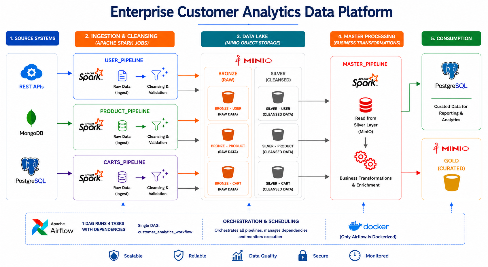
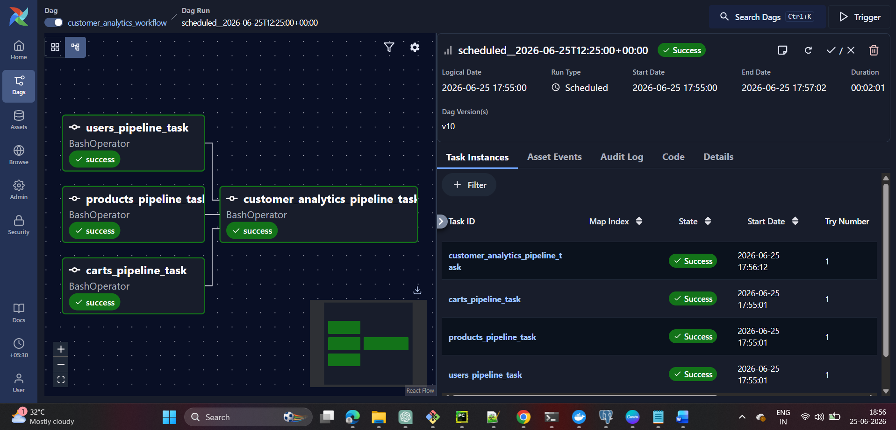
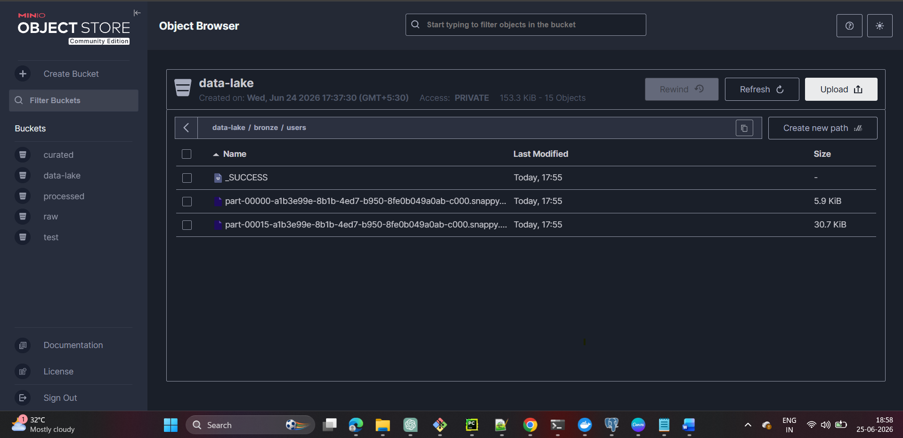
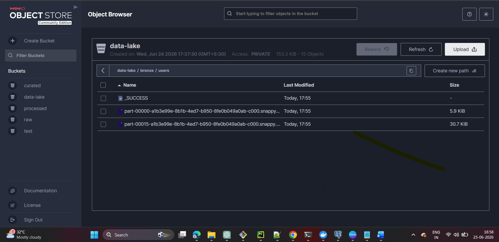
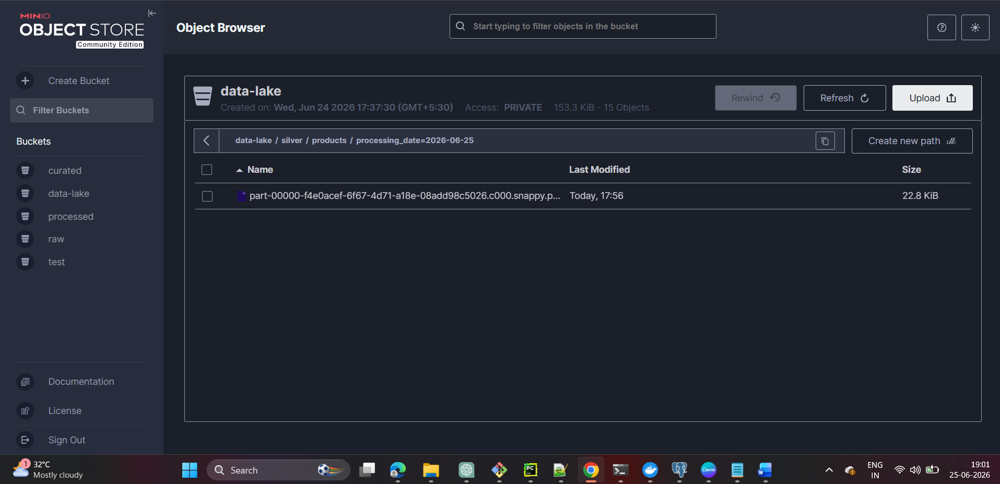
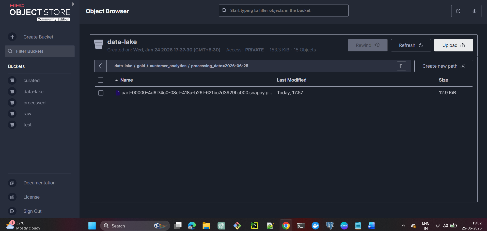
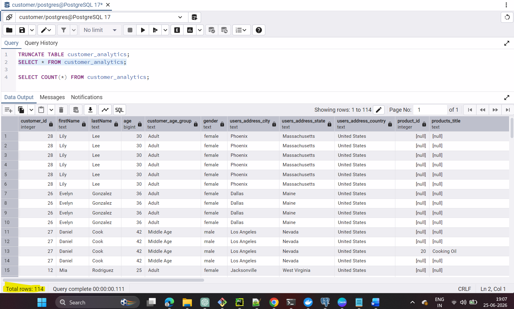

# Enterprise Customer Analytics Data Platform

Built an end-to-end Apache Spark ETL pipeline that ingests customer, product, and transaction data from REST APIs, MongoDB, and PostgreSQL, performs data quality validation, cleansing, enrichment, and business transformations, and implements a Bronze-Silver-Gold Lakehouse architecture using MinIO object storage.

The platform processes multi-source datasets through distributed Spark pipelines, stores raw and cleansed datasets in MinIO Bronze and Silver layers, generates analytics-ready customer insights in the Gold layer, and publishes curated data to PostgreSQL for downstream reporting and analytical consumption.

The workflow is orchestrated using Apache Airflow running in Docker, enabling automated execution of ingestion, transformation, and analytics pipelines with dependency management and monitoring.

## Architecture Diagram




## Key Features

* Multi-source data ingestion from REST APIs, MongoDB, and PostgresSQL
* Apache Spark-based distributed ETL processing
* Bronze-Silver-Gold Medallion Architecture
* Data quality validation, cleansing, and schema standardization
* Customer Analytics Gold Layer generation
* MinIO Data Lake for raw, processed, and curated datasets
* PostgresSQL Analytics Mart for reporting consumption
* Apache Airflow workflow orchestration
* Dockerized orchestration environment
* Modular and production-inspired project structure

## Technology Stack

* Apache Spark 3.5
* Apache Airflow
* MinIO
* MongoDB
* Python
* Docker
* REST APIs
* Parquet
## Project Structure


```text
enterprise-customer-analytics-platform/
│
├── dags/
├── config/
├── src/
│   ├── ingestion/
│   ├── transformation/
│   ├── loaders/
│   ├── analytics/
│   ├── pipeline/
│   └── common/
│
├── tests/
├── docs/
│   ├── architecture/
│   │   └── enterprise_customer_analytics_platform.png
│   └── screenshots/
│
├── requirements.txt
├── .gitignore
└── README.md
```

The platform was validated through successful execution of all ingestion, transformation, and analytics workflows.

Validation included:

- Successful Airflow DAG execution
- Bronze Layer dataset generation
- Silver Layer dataset generation
- Gold Layer dataset generation
- PostgresSQL Analytics Mart population
- Multiple scheduled and manual DAG executions
- Data quality validation checks


## Screenshots

### Airflow DAG Execution


### Bronze Layer Datasets




### Silver Layer Datasets




### Gold Layer Dataset


### PostgreSQL Analytics Mart

